# **抽奖系统V3前端开发说明书**

## **1. 引言 (Introduction)**

### **1.1 项目背景与目标**

本项目旨在构建一个基于 Vue 3 的独立前端应用，作为抽奖系统的用户界面。它与后端 Spring Boot 服务进行交互，提供用户注册、登录、抽奖、查看历史记录等功能。

在 V3.0 版本中，我们重点实现了：

*   **用户认证流程**: 包括注册、登录以及 JWT (JSON Web Token) 的管理。
*   **前端路由保护**: 确保只有认证用户才能访问核心功能页面。
*   **抽奖功能集成**: 调用后端抽奖接口，处理抽奖结果，并显示用户每日抽奖次数。
*   **抽奖历史记录**: 从后端获取并展示用户的抽奖历史，支持分页。

主要目标包括：

*   提供直观、响应式的用户界面。
*   实现与后端 API 的高效、安全的交互。
*   通过前端路由管理，提供流畅的用户体验。
*   妥善处理用户认证状态和数据展示。

### **1.2 功能范围**

**前端功能:**

*   **用户认证**:
    *   用户注册表单。
    *   用户登录表单。
    *   JWT Token 在 `localStorage` 中的存储、获取和清除。
    *   在请求头中携带 JWT Token。
*   **路由管理**:
    *   使用 Vue Router 实现页面间的导航。
    *   基于 JWT Token 的路由守卫，保护需要登录才能访问的页面。
*   **抽奖页面**:
    *   显示当前登录用户的用户名和今日剩余抽奖次数。
    *   “点击抽奖”按钮触发后端抽奖接口调用。
    *   根据后端响应显示抽奖结果（中奖奖品、谢谢参与、次数用尽等）。
    *   按钮禁用状态管理，防止重复点击和次数超限。
*   **抽奖历史页面**:
    *   显示用户的抽奖历史记录列表。
    *   支持抽奖记录的分页展示。
    *   格式化显示抽奖时间。
*   **全局导航**:
    *   顶部导航栏，方便用户在不同页面间切换。
    *   显示当前登录用户的欢迎信息和退出登录按钮。

### **1.3 核心技术栈**

本项目前端部分采用以下技术栈：

| 类别       | 技术名称             | 版本        | 备注                                     |
| :--------- | :------------------- | :---------- | :--------------------------------------- |
| **框架**   | Vue 3                | `3.x`       | 渐进式 JavaScript 框架，使用 Composition API |
| **构建工具** | Vite                 | `7.x`       | 快速、轻量级的前端构建工具               |
| **路由**   | Vue Router           | `4.x`       | Vue 官方路由管理器                       |
| **HTTP 客户端** | `fetch` API          | 内置        | 现代浏览器内置的异步网络请求 API         |
| **包管理** | npm / Yarn           | 最新稳定版  | Node.js 包管理器                         |
| **开发环境** | Node.js              | `18+`       | JavaScript 运行时环境                    |
|            | Visual Studio Code   | 最新稳定版  | 轻量级代码编辑器 (推荐)                  |

## **2. 系统架构设计 (System Architecture Design)**

### **2.1 逻辑架构**

前端应用采用组件化的开发模式，每个页面或功能模块由独立的 Vue 组件构成。通过 Vue Router 进行页面间的导航，并利用 `localStorage` 存储用户认证信息。

*   **`main.js`**: 应用入口文件，创建 Vue 应用实例，挂载 Vue Router。
*   **`App.vue`**: 根组件，负责全局布局（如导航栏）和路由视图 (`<router-view>`) 的渲染。
*   **`router/index.js`**: 路由配置文件，定义所有页面路径、组件映射和导航守卫。
*   **`views/` 目录**: 存放主要页面组件。
    *   `AuthPage.vue`: 登录和注册功能。
    *   `LotteryPage.vue`: 抽奖功能。
    *   `RecordsPage.vue`: 抽奖历史记录展示。
*   **`localStorage`**: 浏览器本地存储，用于持久化 JWT Token、用户 ID 和用户名。

### **2.2 模块交互图**

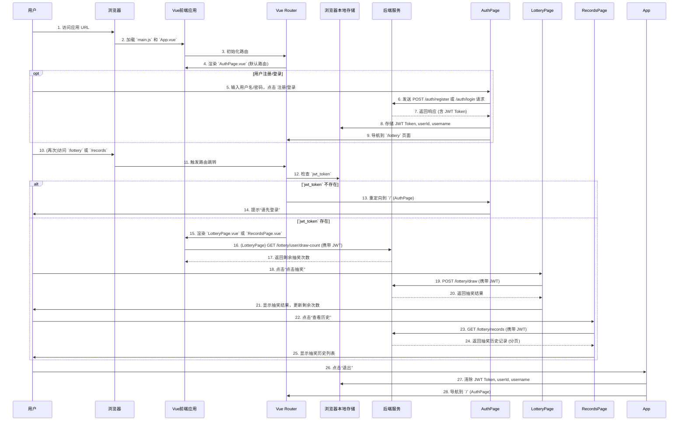

## **3. 开发环境搭建 (Development Environment Setup)**

### **3.1 必备软件安装**

1.  **Node.js (含 npm)**:
    *   下载地址: [Node.js 官方网站](https://nodejs.org/zh-cn/download/) (LTS 版本)
    *   安装程序会同时安装 Node.js 和 npm。
    *   **验证安装**: 打开 PowerShell 命令行，输入 `node -v` 和 `npm -v`，确保能看到版本号。
    *   **可选：安装 Yarn**: `npm install -g yarn`
2.  **Visual Studio Code (VS Code)**:
    *   下载地址: [Visual Studio Code](https://code.visualstudio.com/)
    *   安装并推荐安装 Vue 相关的插件（如 `Volar`）。

### **3.2 Vue 项目初始化 (使用 Vite)**

1.  **打开 PowerShell 命令行**。
2.  **导航到你希望创建前端项目的父目录**（例如，如果后端项目在 `A:\study\javaee\lottery\Lottery`，你可以在 `A:\study\javaee\lottery` 目录下创建前端项目）。
    ```powershell
    cd A:\study\javaee\lottery
    ```
3.  **执行 Vite 创建 Vue 项目的命令**：
    ```powershell
    npm create vite@latest lottery-frontend -- --template vue
    # 或者使用 yarn: yarn create vite lottery-frontend --template vue
    ```
    *   `lottery-frontend`: 这是你新创建的 Vue 项目的文件夹名称。
    *   `--template vue`: 指定创建 Vue 模板项目。
4.  **根据命令行提示进行选择**：
    *   `Project name`: `lottery-frontend` (回车)
    *   `Package name`: `lottery-frontend` (回车)
    *   `Select a framework`: `Vue` (选择，回车)
    *   `Select a variant`: `JavaScript` (选择，回车)
5.  **进入项目目录并安装依赖**：
    ```powershell
    cd lottery-frontend
    npm install # 或者 yarn install
    ```
6.  **运行项目验证**: 安装完成后，尝试运行项目：
    ```powershell
    npm run dev # 或者 yarn dev
    ```
    命令行会提示一个本地开发服务器地址，通常是 `http://localhost:5173/`。在浏览器中打开这个地址，应该能看到 Vue 的欢迎页面。

## **4. 前端代码实现 (Frontend Code Implementation)**

### **4.1 `package.json` 文件**

位于 `lottery-frontend/package.json`。

```json
{
  "name": "lottery-frontend",
  "private": true,
  "version": "0.0.0",
  "type": "module",
  "scripts": {
    "dev": "vite",
    "build": "vite build",
    "preview": "vite preview"
  },
  "dependencies": {
    "vue": "^3.5.17",
    "vue-router": "^4.5.1"
  },
  "devDependencies": {
    "@vitejs/plugin-vue": "^6.0.0",
    "vite": "^7.0.4"
  }
}
```

*   **`dependencies`**:
    *   `vue`: Vue 3 核心库。
    *   `vue-router`: Vue 官方路由库，版本 `^4.x` 与 Vue 3 兼容。
*   **`devDependencies`**:
    *   `@vitejs/plugin-vue`: Vite 官方提供的 Vue 插件。
    *   `vite`: Vite 构建工具。

### **4.2 `main.js` 文件**

位于 `lottery-frontend/src/main.js`。这是 Vue 应用的入口文件。

```javascript
// lottery-frontend/src/main.js

import { createApp } from 'vue';
import './style.css'; // 引入全局样式
import App from './App.vue';
import router from './router'; // 导入我们创建的路由器实例

// 创建 Vue 应用实例
const app = createApp(App);

// 将路由器挂载到应用实例上，使其在整个应用中可用
app.use(router);

// 将应用实例挂载到 HTML 页面中的 #app 元素上
app.mount('#app');
```

### **4.3 `App.vue` 文件**

位于 `lottery-frontend/src/App.vue`。这是 Vue 应用的根组件，负责全局布局和路由视图的渲染。

```vue
<!-- lottery-frontend/src/App.vue -->

<template>
  <div id="app">
    <header class="app-header">
      <nav>
        <router-link to="/">首页/认证</router-link>
        <router-link to="/lottery">抽奖</router-link>
        <router-link to="/records">历史</router-link>
        <!-- 仅当用户登录时显示欢迎信息和退出按钮 -->
        <span v-if="loggedInUsername" class="user-info">
          欢迎, {{ loggedInUsername }}!
          <button @click="logout" class="logout-btn">退出</button>
        </span>
      </nav>
    </header>
    <main class="app-main">
      <!-- 路由视图，根据当前 URL 渲染对应的组件 -->
      <router-view />
    </main>
  </div>
</template>

<script setup>
import { ref, watchEffect } from 'vue'; // 导入 ref 用于响应式数据，watchEffect 用于副作用
import { useRouter } from 'vue-router'; // 导入 useRouter 钩子，用于获取路由器实例

const router = useRouter(); // 获取路由器实例

// loggedInUsername 是一个响应式引用，用于显示当前登录的用户名
// 初始值从 localStorage 获取，如果不存在则为空字符串
const loggedInUsername = ref(localStorage.getItem('username') || '');

// watchEffect 会立即执行一次，并在其依赖项变化时重新执行
// 这里它监听 localStorage 中 'username' 的变化，实时更新 loggedInUsername
watchEffect(() => {
  loggedInUsername.value = localStorage.getItem('username') || '';
});

// 退出登录函数
const logout = () => {
  // 从 localStorage 中移除所有与认证相关的数据
  localStorage.removeItem('jwt_token'); // 移除 JWT Token
  localStorage.removeItem('user_id'); // 移除用户ID
  localStorage.removeItem('username'); // 移除用户名
  loggedInUsername.value = ''; // 清空显示状态
  router.push('/'); // 跳转回认证页面
  alert('您已退出登录。'); // 提示用户
};
</script>

<style>
/* 全局样式可以放在这里，或者 style.css 中 */
#app {
  font-family: Avenir, Helvetica, Arial, sans-serif;
  -webkit-font-smoothing: antialiased; /* 抗锯齿 */
  -moz-osx-font-smoothing: grayscale; /* 灰度抗锯齿 */
  text-align: center;
  color: #2c3e50;
}

.app-header {
  background-color: #333;
  padding: 15px 0;
  color: white;
  box-shadow: 0 2px 5px rgba(0, 0, 0, 0.2); /* 阴影效果 */
}

.app-header nav {
  display: flex; /* 使用 Flexbox 布局 */
  justify-content: center; /* 水平居中对齐子项 */
  gap: 20px; /* 子项之间的间距 */
  align-items: center; /* 垂直居中对齐子项 */
}

.app-header a {
  color: white;
  text-decoration: none; /* 移除下划线 */
  font-weight: bold;
  padding: 5px 10px;
  border-radius: 4px;
  transition: background-color 0.3s ease; /* 背景色过渡效果 */
}

.app-header a:hover,
.app-header a.router-link-active { /* 链接悬停和激活时的样式 */
  background-color: #555;
}

.user-info {
  margin-left: 20px;
  font-weight: bold;
  color: #4CAF50; /* 欢迎信息颜色 */
}

.logout-btn {
  background-color: #dc3545; /* 按钮背景色 */
  color: white;
  border: none;
  padding: 5px 10px;
  border-radius: 4px;
  cursor: pointer;
  margin-left: 10px;
  transition: background-color 0.3s ease;
}

.logout-btn:hover {
  background-color: #c82333;
}

.app-main {
  padding: 20px;
  margin-top: 20px; /* 给主内容区域留出上边距，避免被 header 遮挡 */
}
</style>
```

### **4.4 `router/index.js` 文件**

位于 `lottery-frontend/src/router/index.js`。配置 Vue Router 的路由规则和导航守卫。

```javascript
// lottery-frontend/src/router/index.js

import { createRouter, createWebHistory } from 'vue-router';

// 导入基础页面组件
import AuthPage from '../views/AuthPage.vue';
import LotteryPage from '../views/LotteryPage.vue';
import RecordsPage from '../views/RecordsPage.vue';

// 定义路由数组
const routes = [
  {
    path: '/', // 根路径，默认显示认证页面
    name: 'Auth', // 路由名称
    component: AuthPage // 对应的组件
  },
  {
    path: '/lottery', // 抽奖页面路径
    name: 'Lottery',
    component: LotteryPage,
    meta: { requiresAuth: true } // 元信息：标记此路由需要认证
  },
  {
    path: '/records', // 历史记录页面路径
    name: 'Records',
    component: RecordsPage,
    meta: { requiresAuth: true } // 元信息：标记此路由需要认证
  },
  // 通配符路由：处理所有未匹配的路径，重定向到认证页（可作为 404 页面的简化处理）
  {
    path: '/:pathMatch(.*)*',
    name: 'NotFound',
    redirect: '/'
  }
];

// 创建路由器实例
const router = createRouter({
  history: createWebHistory(), // 使用 HTML5 History 模式（推荐，URL 不带 #）
  routes // 路由配置
});

// 全局前置守卫：在每次路由跳转前执行
router.beforeEach((to, from, next) => {
  // to: 即将进入的目标路由对象
  // from: 当前导航正要离开的路由对象
  // next: 必须调用才能解析该钩子，执行跳转或重定向

  // 检查目标路由的 meta 字段是否需要认证
  if (to.meta.requiresAuth) {
    // 检查 localStorage 中是否存在 JWT Token
    const token = localStorage.getItem('jwt_token');
    if (token) {
      // 如果 Token 存在，则允许访问目标路由
      next();
    } else {
      // 如果 Token 不存在，则重定向到登录/注册页
      alert('请先登录才能访问此页面！'); // 简单提示用户需要登录
      next({ name: 'Auth' }); // 重定向到 Auth 页面
    }
  } else {
    // 对于不需要认证的路由，直接放行
    next();
  }
});

// 导出路由器实例
export default router;
```

### **4.5 `views/AuthPage.vue` 文件**

位于 `lottery-frontend/src/views/AuthPage.vue`。实现用户注册和登录的表单及交互逻辑。

```vue
<!-- lottery-frontend/src/views/AuthPage.vue -->

<template>
  <div class="auth-page">
    <h2>{{ isLogin ? '用户登录' : '用户注册' }}</h2>

    <form @submit.prevent="handleSubmit">
      <div class="form-group">
        <label for="username">用户名:</label>
        <input type="text" id="username" v-model="username" required>
      </div>
      <div class="form-group">
        <label for="password">密码:</label>
        <input type="password" id="password" v-model="password" required>
      </div>
      <button type="submit">{{ isLogin ? '登录' : '注册' }}</button>
    </form>

    <p class="toggle-link" @click="toggleMode">
      {{ isLogin ? '没有账号？去注册' : '已有账号？去登录' }}
    </p>

    <!-- 消息提示区域，根据 message 和 messageClass 动态显示样式 -->
    <p v-if="message" :class="messageClass">{{ message }}</p>
  </div>
</template>

<script setup>
import { ref, computed } from 'vue'; // 导入 ref 用于响应式数据，computed 用于计算属性
import { useRouter } from 'vue-router'; // 导入 useRouter 钩子，用于获取路由器实例

const router = useRouter(); // 获取路由器实例

const isLogin = ref(true); // 控制当前显示登录 (true) 还是注册 (false) 表单
const username = ref(''); // 用户名输入框绑定值
const password = ref(''); // 密码输入框绑定值
const message = ref(''); // 提示消息
const messageClass = ref(''); // 提示消息的样式类 (success, error, info)

// 计算属性，根据 isLogin 的值动态改变表单标题
const formTitle = computed(() => (isLogin.value ? '用户登录' : '用户注册'));

// 切换登录/注册模式
const toggleMode = () => {
  isLogin.value = !isLogin.value; // 切换布尔值
  message.value = ''; // 切换模式时清空提示消息
  username.value = ''; // 清空输入框内容
  password.value = '';
};

// 处理表单提交 (注册或登录)
const handleSubmit = async () => {
  message.value = '处理中...'; // 显示处理中的提示
  messageClass.value = 'info'; // 设置为信息样式

  // 根据当前模式构建请求 URL
  const url = isLogin.value ? 'http://localhost:8080/auth/login' : 'http://localhost:8080/auth/register';
  const method = 'POST';
  const headers = { 'Content-Type': 'application/json' }; // 设置请求头为 JSON
  // 将用户名和密码构造成 JSON 字符串作为请求体
  const body = JSON.stringify({ username: username.value, password: password.value });

  try {
    // 发送 fetch 请求
    const response = await fetch(url, { method, headers, body });
    const data = await response.json(); // 解析响应为 JSON

    if (data.code === 200) {
      message.value = data.message; // 显示后端返回的消息
      messageClass.value = 'success'; // 设置为成功样式
      if (isLogin.value) {
        // 如果是登录模式且登录成功
        const token = data.data.token;
        const userId = data.data.userId;
        const loggedInUsername = data.data.username;

        // 将 JWT Token、用户ID和用户名存储到 localStorage
        localStorage.setItem('jwt_token', token);
        localStorage.setItem('user_id', userId);
        localStorage.setItem('username', loggedInUsername);

        router.push('/lottery'); // 登录成功后跳转到抽奖页面
      } else {
        // 如果是注册模式且注册成功，则切换到登录模式，方便用户直接登录
        toggleMode();
      }
    } else {
      // 后端返回的 code 不为 200，表示操作失败
      message.value = data.message || '操作失败，请重试。'; // 显示后端消息或通用失败消息
      messageClass.value = 'error'; // 设置为错误样式
    }
  } catch (error) {
    // 捕获网络错误或请求失败的情况
    console.error('认证请求失败:', error);
    message.value = '网络错误或服务器无响应。';
    messageClass.value = 'error';
  }
};
</script>

<style scoped>
/* 页面容器样式 */
.auth-page {
  padding: 20px;
  max-width: 400px; /* 最大宽度 */
  margin: 50px auto; /* 居中显示 */
  border: 1px solid #eee;
  border-radius: 8px;
  box-shadow: 0 2px 10px rgba(0, 0, 0, 0.1);
  background-color: #fff;
  text-align: center;
}

h2 {
  color: #333;
  margin-bottom: 20px;
}

/* 表单组样式 */
.form-group {
  margin-bottom: 15px;
  text-align: left; /* 标签和输入框左对齐 */
}

.form-group label {
  display: block; /* 标签独占一行 */
  margin-bottom: 5px;
  font-weight: bold;
}

.form-group input[type="text"],
.form-group input[type="password"] {
  width: calc(100% - 20px); /* 宽度减去内边距 */
  padding: 10px;
  border: 1px solid #ccc;
  border-radius: 4px;
  font-size: 1em;
}

/* 提交按钮样式 */
button[type="submit"] {
  width: 100%;
  padding: 10px;
  background-color: #007bff;
  color: white;
  border: none;
  border-radius: 4px;
  font-size: 1.1em;
  cursor: pointer;
  transition: background-color 0.3s ease;
}

button[type="submit"]:hover {
  background-color: #0056b3;
}

/* 切换模式链接样式 */
.toggle-link {
  margin-top: 15px;
  color: #007bff;
  cursor: pointer;
  text-decoration: underline;
}

.toggle-link:hover {
  color: #0056b3;
}

/* 消息提示样式 */
.info {
  color: #007bff;
  margin-top: 15px;
}

.success {
  color: #28a745;
  margin-top: 15px;
}

.error {
  color: #dc3545;
  margin-top: 15px;
}
</style>
```

### **4.6 `views/LotteryPage.vue` 文件**

位于 `lottery-frontend/src/views/LotteryPage.vue`。实现抽奖功能，包括显示剩余次数、按钮交互和结果展示。

```vue
<!-- lottery-frontend/src/views/LotteryPage.vue -->

<template>
  <div class="lottery-page">
    <h2>幸运大抽奖</h2>
    <!-- 欢迎信息和剩余抽奖次数显示 -->
    <p v-if="username" class="welcome-message">
      欢迎，{{ username }}！您今天还可抽奖 <span class="highlight">{{ remainingDraws }}</span> 次。
    </p>
    <!-- 抽奖按钮，根据状态禁用或显示不同文本 -->
    <button @click="drawLottery" :disabled="isDrawing || remainingDraws <= 0">
      {{ isDrawing ? '抽奖中...' : '点击抽奖' }}
    </button>

    <!-- 消息提示区域 -->
    <p v-if="message" :class="messageClass">{{ message }}</p>
    <!-- 中奖奖品显示区域 -->
    <p v-if="prizeDisplay" class="prize-display">{{ prizeDisplay }}</p>

    <!-- 导航链接 -->
    <router-link to="/records" class="action-link">查看抽奖历史</router-link>
    <router-link to="/" class="action-link">返回认证页</router-link>
  </div>
</template>

<script setup>
import { ref, onMounted } from 'vue'; // 导入 ref 用于响应式数据，onMounted 用于组件挂载生命周期
import { useRouter } from 'vue-router'; // 导入 useRouter 钩子

const router = useRouter(); // 获取路由器实例

// 响应式数据
const username = ref(localStorage.getItem('username') || ''); // 当前登录用户名
const userId = ref(localStorage.getItem('user_id') || null); // 当前登录用户ID
const isDrawing = ref(false); // 抽奖状态，防止重复点击
const message = ref(''); // 提示消息
const messageClass = ref(''); // 提示消息的样式类
const prizeDisplay = ref(''); // 中奖奖品显示
const remainingDraws = ref(0); // 剩余抽奖次数

// 辅助函数：获取 JWT Token，用于添加到请求头
const getAuthHeader = () => {
  const token = localStorage.getItem('jwt_token');
  return token ? { 'Authorization': `Bearer ${token}` } : {};
};

// 获取用户剩余抽奖次数
const fetchRemainingDraws = async () => {
  // 如果用户ID不存在，则无法获取抽奖次数
  if (!userId.value) {
    remainingDraws.value = 0;
    return;
  }
  try {
    // 调用后端接口获取用户今日剩余抽奖次数
    const response = await fetch(`http://localhost:8080/lottery/user/draw-count`, {
      headers: { ...getAuthHeader(), 'Content-Type': 'application/json' }
    });
    const data = await response.json();

    // 处理认证失败或Token过期的情况
    if (response.status === 401 || response.status === 403) {
        alert('登录状态已失效，请重新登录。');
        router.push('/'); // 重定向到登录页
        return;
    }

    if (data.code === 200) {
      remainingDraws.value = data.data.remaining; // 更新剩余次数
      // 如果剩余次数为0，显示提示
      if (remainingDraws.value <= 0) {
        message.value = '您今日的抽奖次数已用完。';
        messageClass.value = 'warning';
      }
    } else {
      // 获取失败，显示错误信息
      console.error('获取抽奖次数失败:', data.message);
      message.value = data.message || '获取抽奖次数失败。';
      messageClass.value = 'error';
      remainingDraws.value = 0;
    }
  } catch (error) {
    // 捕获网络请求错误
    console.error('获取抽奖次数请求失败:', error);
    message.value = '网络错误或获取抽奖次数失败。';
    messageClass.value = 'error';
    remainingDraws.value = 0;
  }
};

// 抽奖逻辑
const drawLottery = async () => {
  // 检查是否正在抽奖或次数已用完
  if (isDrawing.value || remainingDraws.value <= 0) {
    message.value = '您今日的抽奖次数已用完或正在抽奖中。';
    messageClass.value = 'warning';
    return;
  }

  isDrawing.value = true; // 设置抽奖状态为进行中
  message.value = '抽奖中...';
  messageClass.value = 'info';
  prizeDisplay.value = ''; // 清空之前的奖品显示

  try {
    // 发送 POST 请求到后端抽奖接口
    const response = await fetch('http://localhost:8080/lottery/draw', {
      method: 'POST',
      headers: { ...getAuthHeader(), 'Content-Type': 'application/json' } // 确保携带 JWT Token
    });
    const data = await response.json();

    // 处理认证失败或Token过期的情况
    if (response.status === 401 || response.status === 403) {
        alert('登录状态已失效，请重新登录。');
        router.push('/');
        return;
    }

    if (data.code === 200) {
      // 中奖
      message.value = data.message;
      messageClass.value = 'success';
      prizeDisplay.value = `恭喜您获得：${data.data}`;
    } else if (data.code === 404) {
      // 未中奖（包括“谢谢参与”和后端因并发冲突/库存不足返回的未中奖）
      message.value = data.message;
      messageClass.value = 'warning';
      prizeDisplay.value = '';
    } else {
      // 其他业务错误（例如后端返回的自定义错误码）
      message.value = data.message || '抽奖失败，请重试。';
      messageClass.value = 'error';
    }
  } catch (error) {
    // 捕获网络请求错误
    console.error('抽奖请求失败:', error);
    message.value = '网络错误或服务器无响应。';
    messageClass.value = 'error';
  } finally {
    isDrawing.value = false; // 抽奖结束
    // 每次抽奖后，重新获取一下最新的抽奖次数，确保显示准确
    await fetchRemainingDraws();
  }
};

// 组件挂载时执行，获取初始的剩余抽奖次数
onMounted(() => {
  fetchRemainingDraws();
});
</script>

<style scoped>
/* 页面容器样式 */
.lottery-page {
  padding: 20px;
  max-width: 600px;
  margin: 50px auto;
  border: 1px solid #eee;
  border-radius: 8px;
  box-shadow: 0 2px 10px rgba(0, 0, 0, 0.1);
  background-color: #fff;
  text-align: center;
}

h2 {
  color: #333;
  margin-bottom: 20px;
}

/* 欢迎信息样式 */
.welcome-message {
    font-size: 1.1em;
    color: #555;
    margin-bottom: 20px;
}

/* 突出显示的文本样式 */
.highlight {
    color: #007bff;
    font-weight: bold;
}

/* 抽奖按钮样式 */
button {
  padding: 12px 25px;
  font-size: 1.1em;
  background-color: #4CAF50; /* 绿色 */
  color: white;
  border: none;
  border-radius: 5px;
  cursor: pointer;
  transition: background-color 0.3s ease;
  margin-bottom: 20px;
}

button:hover:not(:disabled) { /* 悬停效果，排除禁用状态 */
  background-color: #45a049;
}

button:disabled { /* 禁用状态样式 */
    background-color: #cccccc;
    cursor: not-allowed;
}

/* 消息提示样式 */
.info {
  color: #007bff;
  margin-top: 15px;
}

.success {
  color: #28a745;
  margin-top: 15px;
}

.warning {
    color: #ffc107;
    margin-top: 15px;
}

.error {
  color: #dc3545;
  margin-top: 15px;
}

/* 奖品显示样式 */
.prize-display {
    font-size: 1.8em;
    font-weight: bold;
    color: #e44d26; /* 突出奖品颜色 */
    margin-top: 20px;
}

/* 导航链接样式 */
.action-link {
  display: block;
  margin-top: 10px;
  color: #007bff;
  text-decoration: none;
}
.action-link:hover {
  text-decoration: underline;
}
</style>
```

### **4.7 `views/RecordsPage.vue` 文件**

位于 `lottery-frontend/src/views/RecordsPage.vue`。实现抽奖历史记录的查询和分页展示。

```vue
<!-- lottery-frontend/src/views/RecordsPage.vue -->

<template>
  <div class="records-page">
    <h2>我的抽奖历史</h2>

    <!-- 根据加载状态和记录数量显示不同内容 -->
    <div v-if="records.length === 0 && !isLoading">
      <p>您还没有抽奖记录。</p>
    </div>
    <div v-else-if="isLoading">
      <p>加载中...</p>
    </div>
    <div v-else class="records-list">
      <table>
        <thead>
          <tr>
            <th>抽奖时间</th>
            <th>奖品名称</th>
            <th>结果</th>
          </tr>
        </thead>
        <tbody>
          <!-- 遍历 records 数组显示每一条记录 -->
          <tr v-for="record in records" :key="record.id">
            <td>{{ formatDateTime(record.drawTime) }}</td>
            <td>{{ record.prizeName }}</td>
            <!-- 根据 isWinning 动态添加样式类 -->
            <td :class="record.isWinning === 1 ? 'winning' : 'not-winning'">
              {{ record.isWinning === 1 ? '中奖' : '未中奖' }}
            </td>
          </tr>
        </tbody>
      </table>
      <!-- 分页控制按钮 -->
      <div class="pagination">
        <button @click="prevPage" :disabled="currentPage === 1">上一页</button>
        <span>{{ currentPage }} / {{ totalPages }}</span>
        <button @click="nextPage" :disabled="currentPage === totalPages">下一页</button>
      </div>
    </div>

    <!-- 消息提示区域 -->
    <p v-if="message" :class="messageClass">{{ message }}</p>

    <!-- 导航链接 -->
    <router-link to="/lottery" class="action-link">返回抽奖页面</router-link>
    <router-link to="/" class="action-link">返回认证页</router-link>
  </div>
</template>

<script setup>
import { ref, onMounted, watch } from 'vue'; // 导入 ref, onMounted, watch
import { useRouter } from 'vue-router'; // 导入 useRouter 钩子

const router = useRouter(); // 获取路由器实例

// 响应式数据
const records = ref([]); // 抽奖记录列表
const currentPage = ref(1); // 当前页码，默认为第一页
const pageSize = ref(10); // 每页大小，默认为 10 条记录
const totalRecords = ref(0); // 总记录数
const totalPages = ref(1); // 总页数
const isLoading = ref(false); // 加载状态
const message = ref(''); // 提示消息
const messageClass = ref(''); // 提示消息的样式类

// 辅助函数：获取 JWT Token，用于添加到请求头
const getAuthHeader = () => {
  const token = localStorage.getItem('jwt_token');
  return token ? { 'Authorization': `Bearer ${token}` } : {};
};

// 格式化日期时间字符串为本地可读格式
const formatDateTime = (dateTimeStr) => {
  if (!dateTimeStr) return '';
  // 后端返回的 LocalDateTime 字符串可以直接被 Date 对象解析
  const date = new Date(dateTimeStr);
  return date.toLocaleString(); // 根据用户本地设置格式化日期和时间
};

// 获取抽奖历史记录
const fetchLotteryRecords = async () => {
  isLoading.value = true; // 设置加载状态为 true
  message.value = '加载中...';
  messageClass.value = 'info';

  const userId = localStorage.getItem('user_id'); // 从 localStorage 获取用户ID
  if (!userId) {
    message.value = '用户ID未找到，请重新登录。';
    messageClass.value = 'error';
    isLoading.value = false;
    router.push('/'); // 如果没有用户ID，重定向到登录页
    return;
  }

  try {
    // 调用后端接口获取抽奖历史记录，并传递分页参数
    const response = await fetch(`http://localhost:8080/lottery/records?pageNum=${currentPage.value}&pageSize=${pageSize.value}`, {
      headers: { ...getAuthHeader(), 'Content-Type': 'application/json' } // 确保携带 JWT Token
    });
    const data = await response.json();

    // 处理认证失败或Token过期的情况
    if (response.status === 401 || response.status === 403) {
        alert('登录状态已失效，请重新登录。');
        router.push('/');
        return;
    }

    if (data.code === 200) {
      records.value = data.data; // 绑定当前页的记录列表
      totalRecords.value = data.total; // 更新总记录数
      totalPages.value = data.pages; // 更新总页数
      message.value = ''; // 清空消息
    } else {
      // 加载失败，显示错误信息
      message.value = data.message || '加载记录失败。';
      messageClass.value = 'error';
      records.value = []; // 清空记录列表
    }
  } catch (error) {
    // 捕获网络请求错误
    console.error('获取抽奖记录请求失败:', error);
    message.value = '网络错误或服务器无响应。';
    messageClass.value = 'error';
    records.value = [];
  } finally {
    isLoading.value = false; // 结束加载状态
  }
};

// 分页：上一页
const prevPage = () => {
  if (currentPage.value > 1) { // 确保不是第一页
    currentPage.value--; // 减少页码
  }
};

// 分页：下一页
const nextPage = () => {
  if (currentPage.value < totalPages.value) { // 确保不是最后一页
    currentPage.value++; // 增加页码
  }
};

// 监听 currentPage 变化，当页码改变时重新加载数据
watch(currentPage, () => {
  fetchLotteryRecords();
});

// 组件挂载时执行，加载初始的抽奖历史记录
onMounted(() => {
  fetchLotteryRecords();
});
</script>

<style scoped>
/* 页面容器样式 */
.records-page {
  padding: 20px;
  max-width: 800px; /* 最大宽度 */
  margin: 50px auto; /* 居中显示 */
  border: 1px solid #eee;
  border-radius: 8px;
  box-shadow: 0 2px 10px rgba(0, 0, 0, 0.1);
  background-color: #fff;
  text-align: center;
}

h2 {
  color: #333;
  margin-bottom: 20px;
}

/* 记录列表容器 */
.records-list {
  margin-top: 20px;
}

/* 表格样式 */
table {
  width: 100%;
  border-collapse: collapse; /* 边框合并 */
  margin-bottom: 20px;
}

th, td {
  border: 1px solid #ddd; /* 单元格边框 */
  padding: 10px;
  text-align: left;
}

th {
  background-color: #f2f2f2;
  font-weight: bold;
}

/* 中奖结果样式 */
.winning {
  color: #28a745; /* 绿色 */
  font-weight: bold;
}

.not-winning {
  color: #dc3545; /* 红色 */
}

/* 分页按钮样式 */
.pagination button {
  padding: 8px 15px;
  margin: 0 5px;
  background-color: #007bff;
  color: white;
  border: none;
  border-radius: 4px;
  cursor: pointer;
  transition: background-color 0.3s ease;
}

.pagination button:hover:not(:disabled) {
  background-color: #0056b3;
}

.pagination button:disabled {
    background-color: #cccccc;
    cursor: not-allowed;
}

.pagination span {
    font-weight: bold;
    margin: 0 10px;
}

/* 消息提示样式 */
.info {
  color: #007bff;
  margin-top: 15px;
}

.success {
  color: #28a745;
  margin-top: 15px;
}

.warning {
    color: #ffc107;
    margin-top: 15px;
}

.error {
  color: #dc3545;
  margin-top: 15px;
}

/* 导航链接样式 */
.action-link {
  display: block;
  margin-top: 10px;
  color: #007bff;
  text-decoration: none;
}
.action-link:hover {
  text-decoration: underline;
}
</style>
```

### **4.8 `src/style.css` 文件**

位于 `lottery-frontend/src/style.css`。这是 Vue 项目的全局样式文件，可以根据需要进行调整。

```css
/* 全局 CSS 变量和基本样式 */
:root {
  font-family: system-ui, Avenir, Helvetica, Arial, sans-serif;
  line-height: 1.5;
  font-weight: 400;

  color-scheme: light dark; /* 支持深色模式 */
  color: rgba(255, 255, 255, 0.87); /* 默认文字颜色 */
  background-color: #242424; /* 默认背景色 */

  font-synthesis: none;
  text-rendering: optimizeLegibility;
  -webkit-font-smoothing: antialiased;
  -moz-osx-font-smoothing: grayscale;
}

/* 链接默认样式 */
a {
  font-weight: 500;
  color: #646cff;
  text-decoration: inherit;
}
a:hover {
  color: #535bf2;
}

/* body 默认样式 */
body {
  margin: 0;
  display: flex; /* 使用 flex 布局居中内容 */
  place-items: center; /* 水平垂直居中 */
  min-width: 320px;
  min-height: 100vh; /* 最小高度充满视口 */
}

/* h1 默认样式 */
h1 {
  font-size: 3.2em;
  line-height: 1.1;
}

/* button 默认样式 */
button {
  border-radius: 8px;
  border: 1px solid transparent;
  padding: 0.6em 1.2em;
  font-size: 1em;
  font-weight: 500;
  font-family: inherit;
  background-color: #1a1a1a;
  cursor: pointer;
  transition: border-color 0.25s;
}
button:hover {
  border-color: #646cff;
}
button:focus,
button:focus-visible {
  outline: 4px auto -webkit-focus-ring-color;
}

/* .card 类，Vite 默认模板中的示例 */
.card {
  padding: 2em;
}

/* #app 根元素样式 */
#app {
  max-width: 1280px;
  margin: 0 auto;
  padding: 2rem;
  text-align: center;
}

/* 媒体查询：浅色主题 */
@media (prefers-color-scheme: light) {
  :root {
    color: #213547;
    background-color: #ffffff;
  }
  a:hover {
    color: #747bff;
  }
  button {
    background-color: #f9f9f9;
  }
}
```

## **5. 系统运行与测试 (Running & Testing)**

### **5.1 启动后端服务**

1.  **打开 IntelliJ IDEA**，导航到后端项目 `Lottery` 的 `src/main/java/com/miku/lottery/LotteryApplication.java`。
2.  右键点击文件空白处或类名，选择 `Run 'LotteryApplication.main()'`。
3.  观察 IDEA 控制台输出，确认最后一行日志显示类似 `Tomcat started on port 8080` 字样，表示后端服务已成功启动并监听 8080 端口。

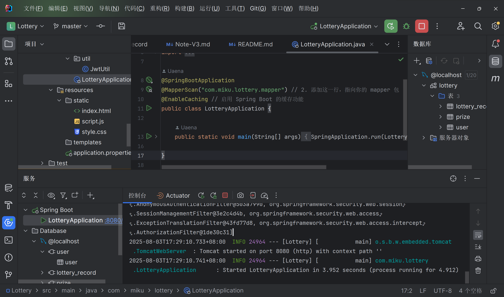

### **5.2 启动前端服务**

1. 打开 PowerShell 命令行，导航到你的 Vue 项目目录 (`lottery-frontend`)。

2.  运行 Vue 开发服务器：
    ```powershell
    npm run dev # 或者 yarn dev
    ```
    
3.  命令行会提示一个本地开发服务器地址，通常是 `http://localhost:5173/`。

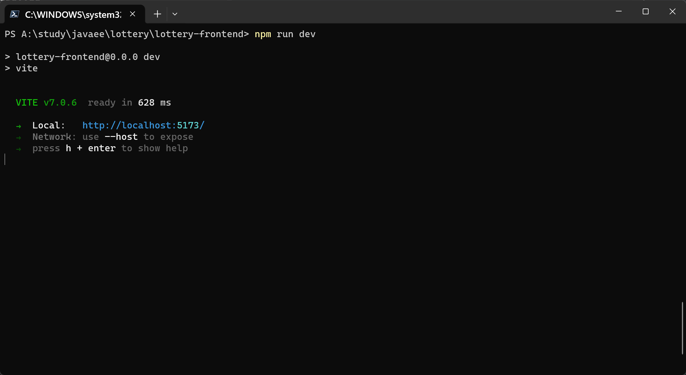

### **5.3 综合功能测试**

1. **访问前端页面**: 在浏览器中访问 `http://localhost:5173/`。

2.  **用户注册**:
    *   在登录/注册页面，点击“没有账号？去注册”。
    *   输入用户名（例如 `testuser`）和密码（例如 `123456`），点击“注册”。
    *   页面应显示“注册成功！”并自动切换回登录模式。观察后端控制台是否有注册成功的日志。
    
    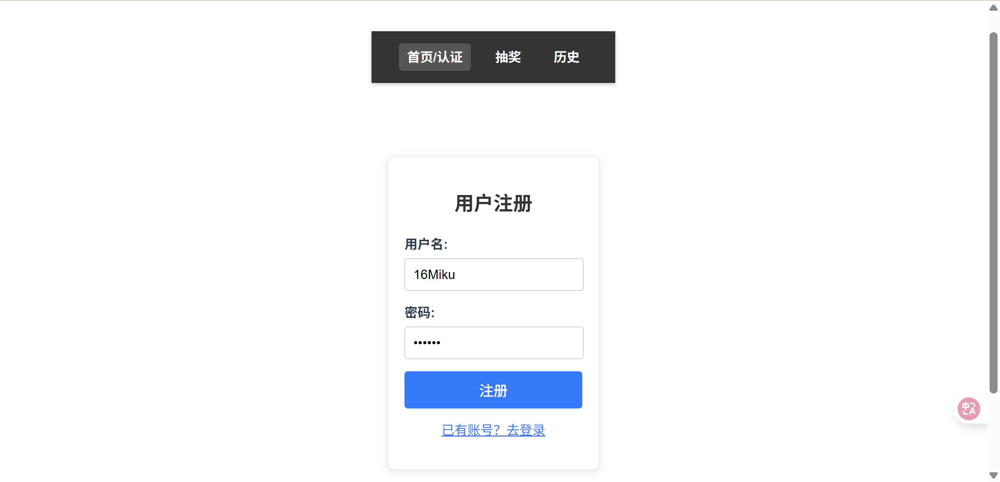
    
    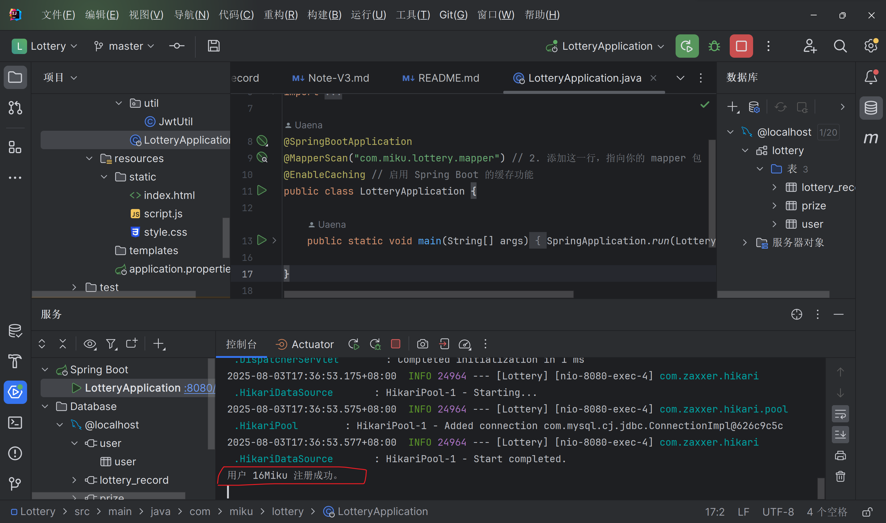
    
    
    
3. **用户登录**:

   *   在登录页面，输入刚刚注册的用户名和密码，点击“登录”。
   *   如果成功，你应该会被重定向到 `/lottery` 页面。
   *   顶部导航栏会显示“欢迎, `testuser`!”。
   *   检查浏览器开发者工具 (`F12`) 的 `Application` -> `Local Storage`，确认 `jwt_token`、`user_id` 和 `username` 已正确存储。

   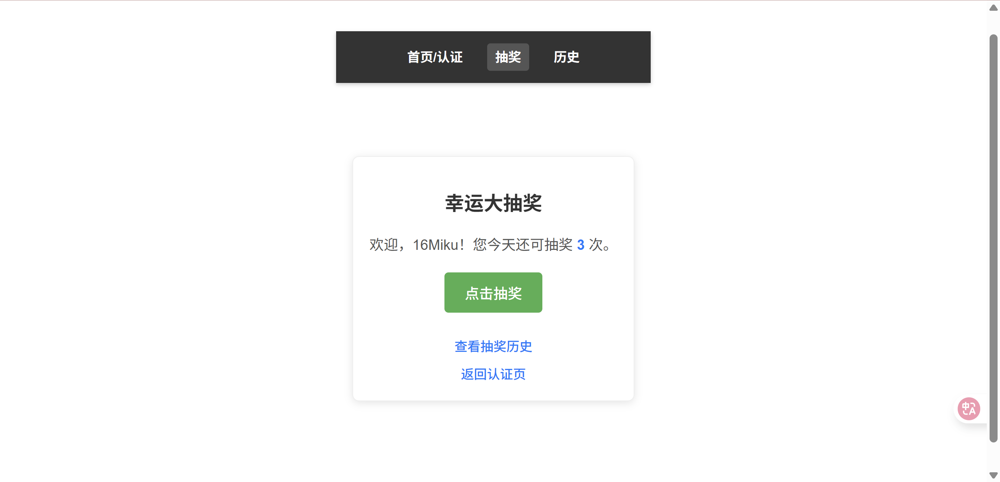

   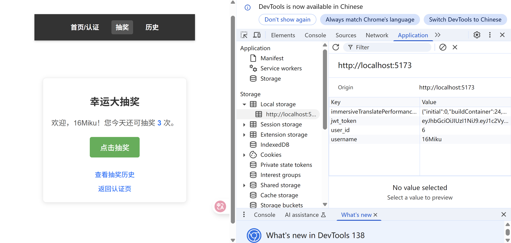

   

4. **抽奖功能测试**:

   *   在 `/lottery` 页面，验证是否显示“您今天还可抽奖 X 次。”的提示。
   *   **连续点击“点击抽奖”按钮**：
       *   前 3 次（假设最大次数为 3）应该能正常触发抽奖，页面显示中奖结果或“谢谢参与”。
       *   第 4 次点击时，页面应提示“您今日的抽奖次数已用完。”，并且抽奖按钮变为禁用状态。
       *   观察后端控制台，确认每次抽奖的日志（如“恭喜用户...抽中奖品”或“库存扣减失败”等）和抽奖次数的 Redis 操作日志。

   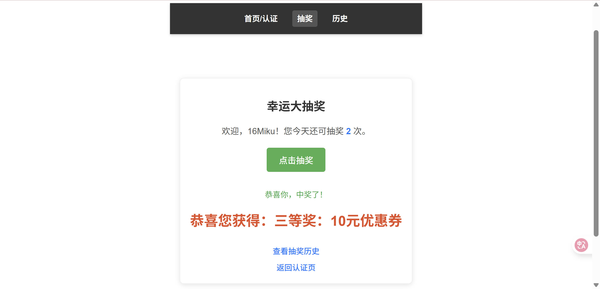

   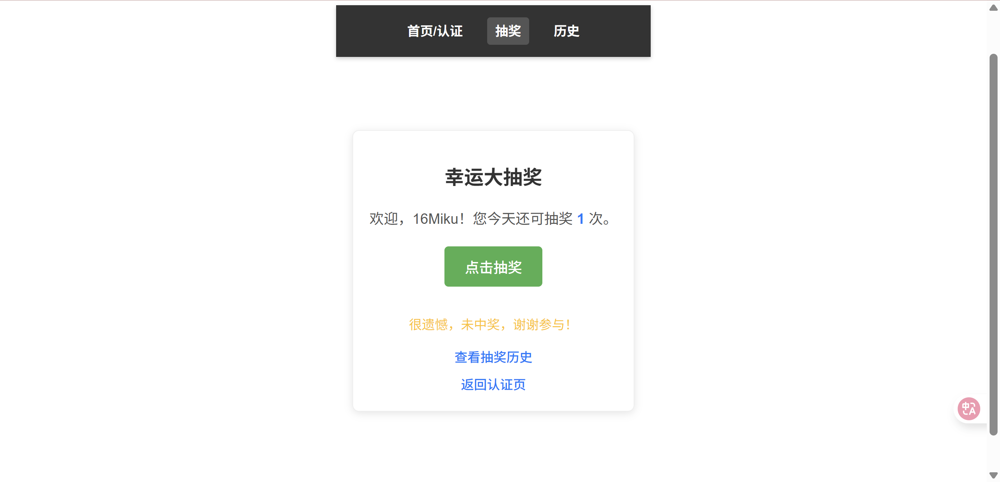

   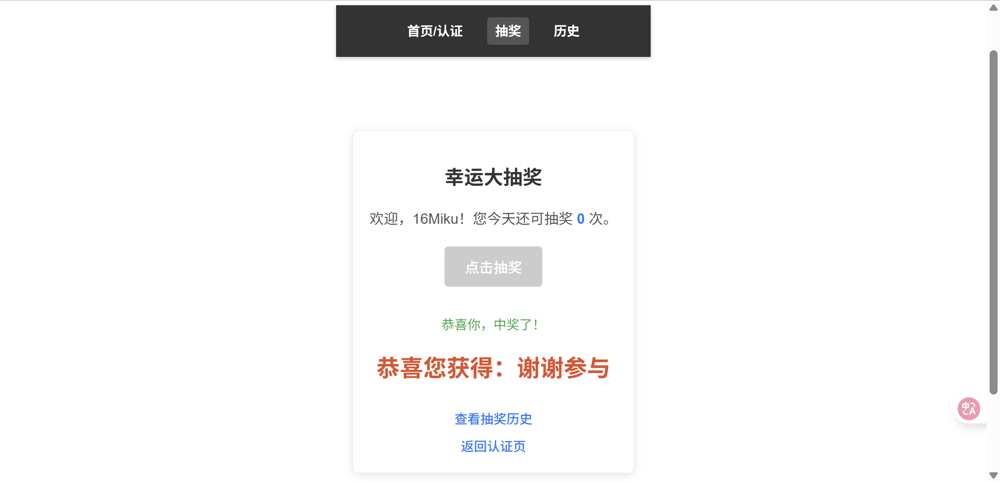

   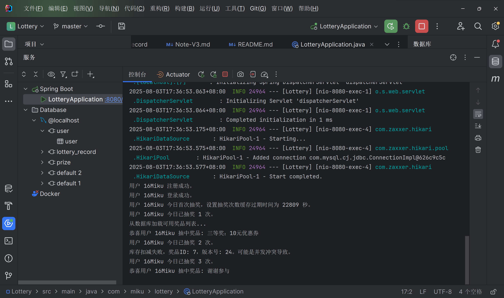

   

5. **抽奖历史记录测试**:

   *   点击顶部导航栏的“历史”链接，跳转到 `/records` 页面。
   *   验证页面是否正确显示当前用户的抽奖历史记录列表，包括抽奖时间、奖品名称和结果（中奖/未中奖）。
   *   尝试刷新页面，数据应保持不变。
   *   如果记录较多，测试分页功能（“上一页”、“下一页”）是否正常工作。

   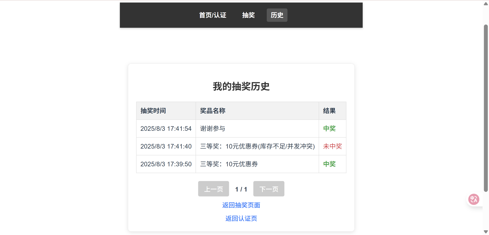

   

6. **多用户隔离测试**:

   *   点击顶部导航栏的“退出”按钮，清除本地 Token，返回认证页。
   *   注册一个新的用户（例如 `anotheruser`，密码 `123456`）。
   *   登录 `anotheruser`，重复抽奖和历史记录测试，验证其抽奖次数和历史记录与 `testuser` 是完全独立隔离的。

7. **路由保护测试**:
   *   在未登录状态下（确保 `localStorage` 中没有 Token），尝试直接在浏览器地址栏输入 `http://localhost:5173/lottery` 或 `http://localhost:5173/records`。
   *   预期结果：你会被重定向回 `http://localhost:5173/` (认证页面)，并收到“请先登录才能访问此页面！”的弹窗提示。

## **6. 开发过程中遇到的困难与解决方案总结**

在前端项目开发“用户系统与抽奖限制”阶段，我们遇到了一些常见但关键的问题，并成功解决了它们。

### **6.1 困难一：CORS 跨域问题**

*   **现象**: 前端应用（运行在 `http://localhost:5173`）尝试向后端服务（运行在 `http://localhost:8080`）发送请求时，浏览器控制台报错 `CORS policy: No 'Access-Control-Allow-Origin' header is present on the requested resource.`。
*   **原因分析**: 浏览器出于安全考虑，默认禁止跨域请求。当请求的协议、域名、端口中任一不同时，即视为跨域。后端服务器未在响应头中包含 `Access-Control-Allow-Origin` 字段，告知浏览器允许来自前端域名的请求。
*   **解决方案**:
    *   在后端 Spring Boot 项目中添加 CORS 配置。创建 `WebConfig.java` 类并实现 `WebMvcConfigurer` 接口，重写 `addCorsMappings` 方法。
    *   在 `addCorsMappings` 中，通过 `registry.addMapping("/**").allowedOrigins("http://localhost:5173").allowedMethods(...)` 等配置，明确允许来自前端开发服务器的请求，并设置允许的 HTTP 方法、请求头和凭证。

### **6.2 困难二：JWT Token 的存储与请求携带**

*   **现象**: 用户登录成功后，如何保存 Token 以便后续请求使用？以及如何将 Token 附加到受保护的 API 请求中？
*   **原因分析**: JWT 是无状态的，需要客户端（前端）在每次请求时携带。Token 的存储位置和携带方式是关键。
*   **解决方案**:
    *   **存储**: 将 JWT Token 存储在**浏览器 `localStorage`** 中。`localStorage.setItem('jwt_token', token)`。同时，为了方便，也存储了 `user_id` 和 `username`。
    *   **携带**: 在发送需要认证的后端请求时，通过 `headers` 选项将 Token 添加到 `Authorization` 请求头中，格式为 `Authorization: Bearer <your_jwt_token>`。在 `LotteryPage.vue` 和 `RecordsPage.vue` 中都封装了 `getAuthHeader()` 辅助函数来实现这一点。

### **6.3 困难三：前端路由保护 (未登录用户访问受限页面)**

*   **现象**: 用户未登录时，可以直接通过 URL 访问抽奖页面或历史记录页面，导致功能异常或数据不正确。
*   **原因分析**: 默认情况下，Vue Router 不会检查用户的登录状态。
*   **解决方案**:
    *   使用 Vue Router 的**全局前置守卫 (`router.beforeEach`)**。
    *   在路由配置中，为需要认证的路由添加 `meta: { requiresAuth: true }` 标记。
    *   在 `router.beforeEach` 守卫中，检查目标路由是否包含 `requiresAuth` 标记。如果包含，则检查 `localStorage` 中是否存在 `jwt_token`。
    *   如果 `jwt_token` 不存在，则 `alert` 提示用户并重定向到登录页面 (`next({ name: 'Auth' })`)。

### **6.4 困难四：动态数据绑定与实时更新**

*   **现象**: 登录后，顶部导航栏的用户名不会立即显示，或抽奖后剩余次数不会实时更新。
*   **原因分析**: Vue 的响应式系统需要正确地触发更新。直接修改 `localStorage` 不会自动触发 Vue 组件的重新渲染。
*   **解决方案**:
    *   对于导航栏的用户名，在 `App.vue` 中使用 `watchEffect` 监听 `localStorage.getItem('username')` 的变化，确保 `loggedInUsername` 响应式地更新。
    *   对于抽奖页面的剩余抽奖次数，在 `drawLottery` 方法的 `finally` 块中，**再次调用 `fetchRemainingDraws()`** 函数。这确保了每次抽奖完成（无论成功或失败）后，都会重新从后端获取最新的抽奖次数并更新显示。

### **6.5 困难五：日期时间格式化显示**

*   **现象**: 从后端获取的抽奖记录中，`drawTime` 字段是 `LocalDateTime` 字符串格式，直接显示不友好。
*   **原因分析**: 后端 Java 的 `LocalDateTime` 序列化为 ISO 8601 格式的字符串，前端需要进行格式化。
*   **解决方案**:
    *   在 `RecordsPage.vue` 中定义 `formatDateTime` 辅助函数。
    *   该函数将后端返回的 `dateTimeStr` 字符串传入 JavaScript 的 `new Date()` 构造函数进行解析。
    *   然后使用 `Date.toLocaleString()` 方法，根据用户的本地设置，将日期时间格式化为可读性更高的字符串。

### **6.6 困难六：抽奖次数用尽时的按钮禁用**

*   **现象**: 用户抽奖次数用尽后，抽奖按钮仍然可点击，但后端会拒绝请求。
*   **原因分析**: 需要在前端根据剩余抽奖次数动态控制按钮的可用状态。
*   **解决方案**:
    *   在 `LotteryPage.vue` 中，将抽奖按钮的 `disabled` 属性绑定到 `isDrawing` (防止重复点击) 和 `remainingDraws <= 0` (次数用尽) 的组合条件：`:disabled="isDrawing || remainingDraws <= 0"`。
    *   当 `remainingDraws` 更新为 0 时，按钮会自动禁用，提供更好的用户体验。

### **6.7 困难七：抽奖记录分页功能的实现**

*   **现象**: 抽奖记录数量多时，一次性加载所有记录会影响性能和用户体验。
*   **原因分析**: 需要前端向后端发送分页请求，后端返回分页数据，前端再根据分页信息控制页面显示和分页按钮。
*   **解决方案**:
    *   **后端**: 在 `LotteryController` 的 `getLotteryRecords` 接口中，接收 `pageNum` 和 `pageSize` 参数，并利用 MyBatis-Plus 的分页功能返回分页数据（`records`、`total`、`pages` 等）。同时，需要在后端配置 MyBatis-Plus 的分页插件（`MybatisPlusConfig.java`）。
    *   **前端**: 在 `RecordsPage.vue` 中：
        *   定义 `currentPage`、`pageSize`、`totalRecords`、`totalPages` 等响应式数据。
        *   `fetchLotteryRecords` 函数接收 `pageNum` 和 `pageSize` 参数，并发送请求到后端。
        *   `watch(currentPage, ...)` 监听 `currentPage` 变化，自动重新加载数据。
        *   提供“上一页”和“下一页”按钮，并根据 `currentPage` 和 `totalPages` 动态控制其禁用状态。

## **7. 未来增强与优化 (Future Enhancements & Optimizations)**

当前前端项目已经具备了用户认证、抽奖和历史记录的核心功能，但仍有许多可以改进和扩展的地方：

*   **UI/UX 优化**: 引入更专业的 UI 组件库（如 Element Plus, Ant Design Vue），美化界面，提升用户体验。
*   **表单验证**: 增加更严格的前端表单验证（如用户名长度、密码复杂度），减少无效请求到后端。
*   **错误提示优化**: 使用更友好的消息框或通知组件（如 `toast`）代替 `alert`，提供更好的用户反馈。
*   **状态管理**: 对于更复杂的应用，可以引入 Pinia 或 Vuex 进行全局状态管理，替代简单的 `localStorage` 和组件间通信。
*   **Loading 状态**: 在所有数据请求期间，增加加载动画或骨架屏，提升用户体验。
*   **响应式设计**: 进一步优化在不同屏幕尺寸（手机、平板、桌面）上的布局和显示。
*   **单元测试/端到端测试**: 编写前端测试用例，确保代码质量和功能稳定性。
*   **打包优化**: 进一步优化 Vite 打包配置，减小前端资源体积，提升加载速度。


